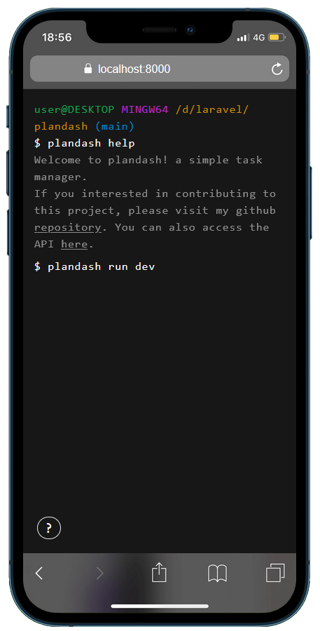
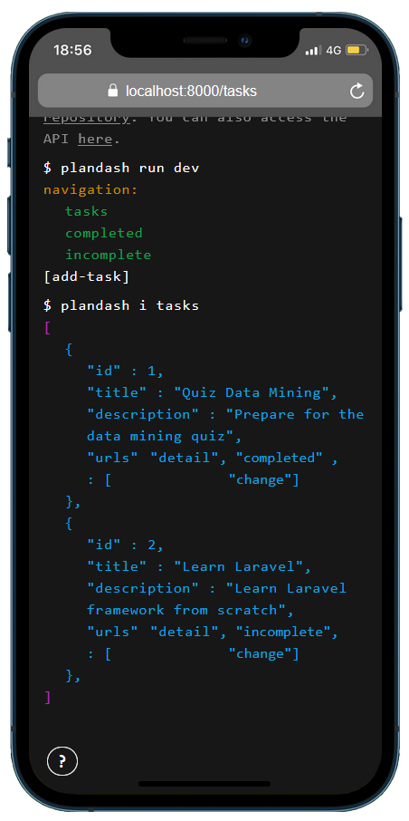
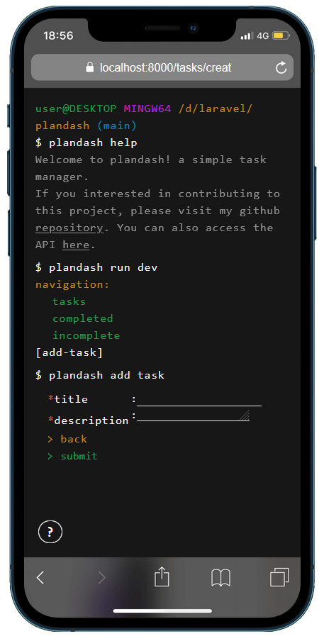
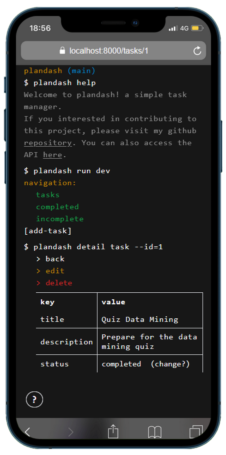
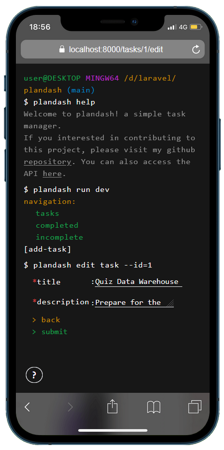
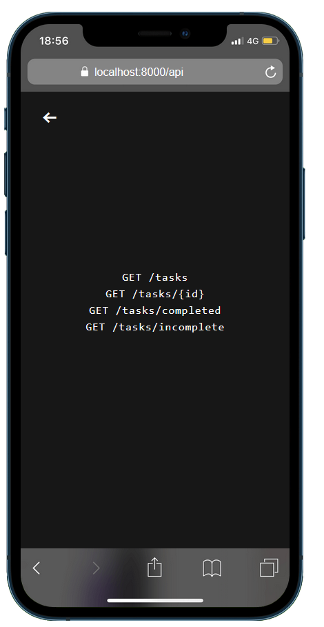
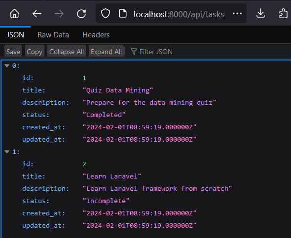

Step by step

1. Welcome - click plandash run dev

2. Home - Choose navigation, add task, also click the urls to interact with data

3. Add task - fill in the form and click submit

4. Detail task - click edit or delete, also click the change status

5. Edit task - change the task and click submit

6. API - click the urls to interact with data

